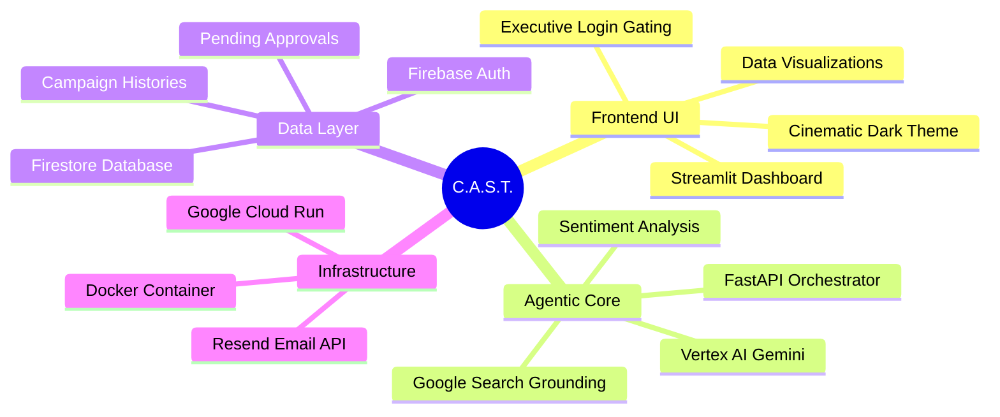

# 🎬 C.A.S.T. (Crisis Analysis & Strategy Tracker)


**C.A.S.T.** is an autonomous, agentic PR monitoring platform designed for high-stakes film campaigns. It leverages Google Vertex AI, Native Web Grounding, and Firestore to track real-time sentiment, detect PR crises before they blow up, and autonomously generate strategic pivot recommendations that require executive governance to approve.

## 🧠 System Architecture Mind Map



## 🚀 Key Features
- **Real-Time Orchestration:** Triggers AI agents to scrape and summarize live audience and critic sentiment via Google Grounding.
- **Crisis Detection:** Automatically flags campaigns dropping below the "Crisis Floor" (score < 25) and generates strategic PR pivots.
- **Executive Governance:** Strict Role-Based Access Control (RBAC). Only authenticated `executive` accounts can approve or reject AI-proposed strategies.
- **Cinematic UI/UX:** A beautifully tailored Streamlit interface featuring full-screen dynamic backgrounds, custom CSS overlays, and responsive Plotly charting.
- **Automated Alerts:** Integrates with the Resend API to instantly email executives when a crisis pivot requires human-in-the-loop approval.

## 📂 Project Structure

```text
C.A.S.T./
│
├── agent/
│   ├── orchestrator.py        # Core AI orchestrator logic & crisis detection
│   └── tool_schemas.py        # Schema definitions for Vertex AI tools
│
├── tools/
│   └── notifier.py            # Resend email API integration
│
├── dashboard.py               # Streamlit Frontend (UI/UX, Auth, Visuals)
├── main.py                    # FastAPI Backend (Endpoints, Agent Trigger)
│
├── deploy.ps1                 # PowerShell Cloud Run deployment script
├── deploy.sh                  # Bash Cloud Run deployment script
├── Dockerfile                 # Unified container definition (FastAPI + Streamlit)
├── requirements.txt           # Python dependencies
├── .env                       # Environment variables (API Keys, Project IDs)
├── .gitignore                 # Security configurations (Excludes .env)
│
├── LICENSE                    # MIT License
└── README.md                  # Project documentation
```

## 🛠️ Local Setup & Installation

**1. Clone the repository**
```bash
git clone https://github.com/i-ayush-7/C.A.S.T.git
cd C.A.S.T.
```

**2. Create a Virtual Environment**
```bash
python -m venv venv
source venv/bin/activate  # On Windows use: .\venv\Scripts\activate
```

**3. Install Dependencies**
```bash
pip install -r requirements.txt
```

**4. Environment Variables**
Create a `.env` file in the root directory (do not commit this file) and populate it with your keys:
```env
GCP_PROJECT_ID=your-google-cloud-project-id
FIREBASE_WEB_API_KEY=your-firebase-web-api-key
RESEND_API_KEY=your-resend-api-key
ALERT_EMAIL_ADDRESS=executive@yourdomain.com
```

**5. Run the Application locally**
Start the FastAPI backend and Streamlit UI:
```bash
# Terminal 1 (Backend)
uvicorn main:app --port 8000

# Terminal 2 (Frontend)
streamlit run dashboard.py --server.port 8501
```

## ☁️ Deployment (Google Cloud Run)

The platform is designed to be deployed as a unified Docker container to Google Cloud Run.

Ensure you are authenticated with `gcloud` and have the required IAM permissions (`roles/run.admin`, `roles/datastore.user`, `roles/aiplatform.user`), then run:

```powershell
# Windows
.\deploy.ps1
```
```bash
# macOS / Linux
chmod +x deploy.sh
./deploy.sh
```

## 📄 License
This project is licensed under the MIT License - see the [LICENSE](LICENSE) file for details.
